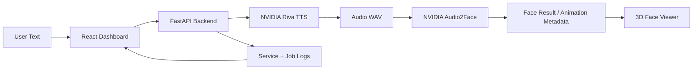

<div align="center">

# FaceSpeed: NVIDIA Riva → Audio2Face Web Pipeline

Text-to-speech-to-face dashboard for running NVIDIA Riva TTS, sending audio to NVIDIA Audio2Face, and previewing a 3D face in the browser.


[Overview](#overview) · [Flow](#system-flow) · [Quick Start](#quick-start) · [NVIDIA Host Setup](#nvidia-host-setup) · [Repository Map](#repository-map) · [Accuracy Notes](#accuracy-notes)

</div>

## Overview

FaceSpeed is a full-stack control plane for this pipeline:

| Layer | Purpose | Current status |
|---|---|---|
| Backend | FastAPI API, service controls, job orchestration, Riva/A2F adapters | Implemented |
| Frontend | Dashboard for pipeline, services, logs, system checks and 3D face preview | Implemented |
| NVIDIA Riva | Real TTS adapter through `nvidia-riva-client` | Requires NVIDIA host |
| Audio2Face | Configurable HTTP adapter for A2F service automation | Requires A2F endpoint |
| Setup | System checks and NVIDIA setup helper modes | Implemented |
| CI | Backend tests and frontend test/build | Implemented |

## System Flow



## Quick Start

### Backend

```powershell
python -m venv backend/.venv
backend/.venv/Scripts/python.exe -m pip install -r backend/requirements.txt
backend/.venv/Scripts/python.exe -m pytest backend tests
backend/.venv/Scripts/python.exe -m uvicorn src.main:app --host 127.0.0.1 --port 8001 --app-dir backend
```

### Frontend

```powershell
cd frontend
npm install
npm test
npm run build
$env:VITE_API_BASE_URL='http://127.0.0.1:8001'
npx vite --host 127.0.0.1 --port 6200 --strictPort
```

Open:

```text
http://127.0.0.1:6200/
```

## NVIDIA Host Setup

Copy `.env.example` to `.env` and set:

```env
PIPELINE_MODE=nvidia
RIVA_HOST=127.0.0.1
RIVA_PORT=50051
RIVA_SAMPLE_RATE_HZ=22050
A2F_HOST=127.0.0.1
A2F_PORT=8011
A2F_PROCESS_PATH=/api/process-audio
A2F_TIMEOUT_SECONDS=120
```

Run checks on the Linux NVIDIA host:

```bash
./scripts/setup.sh --check-nvidia
./scripts/setup.sh --install-ngc
ngc config set
./scripts/setup.sh --install-riva
./scripts/setup.sh --start-riva
./scripts/setup.sh --check-riva
./scripts/setup.sh --check-a2f
```

Use `./scripts/setup.sh --nvidia-full` only after NGC CLI, Riva quickstart assets and Audio2Face service mode are prepared.

## Application Pipelines

| Pipeline | Endpoint/UI | Notes |
|---|---|---|
| Service control | `/api/services` | Uses explicit service allowlist |
| Job creation | `/api/jobs` | Mock or NVIDIA mode via `PIPELINE_MODE` |
| Riva TTS | `NvidiaRivaTtsClient` | Requires reachable Riva gRPC server |
| Audio2Face | `NvidiaAudio2FaceClient` | HTTP path is configurable because A2F deployments vary |
| 3D preview | `FaceViewer` | Browser shows procedural face now; real A2F artifacts can replace source |

## Repository Map

```text
backend/                 FastAPI backend
  src/services/          Riva, Audio2Face, jobs, service manager
  tests/                 Backend tests
frontend/                React/Vite dashboard
  src/components/        UI and 3D face viewer
  src/pages/             Pipeline, services, logs, system pages
scripts/setup.sh         System and NVIDIA setup helper
docs/phase-reports/      Implementation reports
plans/                   Project plans
.github/workflows/ci.yml CI pipeline
```

## Docs Index

- `plans/plan-text-to-speech-to-face-platform.md`
- `plans/plan-real-nvidia-riva-a2f-3d-face-github.md`
- `docs/phase-reports/phase-6-nvidia-integration.md`

## Accuracy Notes

- Local tests pass for backend, setup script, frontend rendering and frontend production build.
- Real Riva and Audio2Face smoke tests require an NVIDIA Linux host with GPU, Docker NVIDIA runtime, NGC access, Riva server and Audio2Face automation endpoint.
- The browser 3D face preview is implemented now as a procedural model. It is ready to be wired to a real exported A2F model/animation once that artifact endpoint is available.
