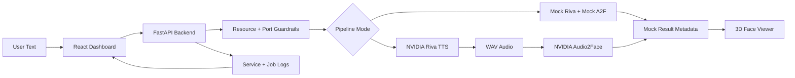

<div align="center">

# FaceSpeed: NVIDIA Riva → Audio2Face Web Pipeline

Text-to-speech-to-face dashboard for running a safe local mock pipeline, preparing NVIDIA Riva and Audio2Face containers, and previewing a lightweight 3D face in the browser.


[Overview](#overview) · [Flow](#system-flow) · [Quick Start](#quick-start-local-mock) · [NVIDIA Setup](#nvidia-container-setup-safe-workflow) · [Tests](#tests) · [Repository Map](#repository-map) · [Accuracy Notes](#accuracy-notes)

</div>

## Overview

FaceSpeed is a full-stack control plane for this pipeline:

| Layer | Purpose | Current status |
|---|---|---|
| Backend | FastAPI API, service controls, job orchestration, Riva/A2F adapters | Implemented |
| Frontend | Dashboard for pipeline, services, logs, system checks and 3D face preview | Implemented |
| Local mock pipeline | Text → mock audio → mock A2F result | Tested |
| NVIDIA Riva | Real TTS adapter and safe container dry-run workflow | Adapter implemented; real container smoke blocked |
| Audio2Face | Configurable HTTP adapter and safe container dry-run workflow | Adapter implemented; image/API verification blocked |
| Setup | Read-only resource/port/GPU/Docker guardrails | Implemented |
| CI | Non-GPU backend/setup/frontend tests and build | Implemented |

## System Flow



## Quick Start: Local Mock

The safe local ports are:

```text
Backend API: 127.0.0.1:8020
Frontend:    127.0.0.1:6210
Riva gRPC:   127.0.0.1:50100
Audio2Face:  127.0.0.1:8040
```

### Backend

```bash
backend/.venv-linux/bin/python -m pip install -r backend/requirements.txt
BACKEND_HOST=127.0.0.1 \
BACKEND_PORT=8020 \
PIPELINE_MODE=mock \
ALLOWED_ORIGINS=http://127.0.0.1:6210,http://localhost:6210 \
backend/.venv-linux/bin/python -m uvicorn src.main:app --host 127.0.0.1 --port 8020 --app-dir backend
```

If the Linux venv does not exist yet, create it first:

```bash
python3 -m venv backend/.venv-linux
backend/.venv-linux/bin/python -m pip install -r backend/requirements.txt
```

### Frontend

```bash
npm --prefix frontend install
VITE_API_BASE_URL=http://127.0.0.1:8020 \
npm --prefix frontend run dev -- --host 127.0.0.1 --port 6210 --strictPort
```

Open locally or forward port `6210` through VS Code/Visual port forwarding:

```text
http://127.0.0.1:6210/
```

Do not bind the app to `0.0.0.0` unless authentication and network exposure have been reviewed.

## NVIDIA Container Setup: Safe Workflow

Before any NVIDIA pull/start/smoke test, run read-only preflight checks:

```bash
bash scripts/setup.sh --check-ports
bash scripts/setup.sh --check-resources
bash scripts/setup.sh --check-gpu-light
bash scripts/setup.sh --check-docker-space
bash scripts/setup.sh --dry-run-nvidia-full
```

Hard gates for heavy work:

- Target ports must be free; if a port is busy, stop and ask for a new port. Do not kill the owner process.
- RAM available must stay above 10%.
- Memory commit headroom must stay above 10%.
- Disk free must stay above 10%.
- GPU free VRAM must stay above 10%.
- Existing GPU processes are treated as important and must not be stopped.
- Docker cleanup is limited to stopped/unused resources after explicit confirmation.

Container dry-run only prints scoped commands; it does not pull, start, stop, remove or prune anything:

```bash
export RIVA_CONTAINER_IMAGE=<verified-riva-image>
export A2F_CONTAINER_IMAGE=<verified-audio2face-image>
export CONTAINER_MEMORY_LIMIT=16g
export CONTAINER_CPU_LIMIT=8
export GPU_DEVICE_FLAG='--gpus device=0'
bash scripts/setup.sh --dry-run-containers
```

Project containers must use:

```text
name prefix: facespeed-
label: com.facespeed.project=NVIDIARiva-Audio2Face-facespeed
bind: 127.0.0.1 only
restart policy: no
```

Cache/assets stay inside the project:

```text
.cache/nvidia/ngc/
.cache/nvidia/riva/
.cache/nvidia/audio2face/
outputs/smoke/
logs/setup/
```

Never commit NVIDIA/NGC keys. If a key was exposed in chat or logs, rotate it after setup.

## Tests

Non-GPU tests used for CI and local verification:

```bash
backend/.venv-linux/bin/python -m pytest backend tests
npm --prefix frontend test
npm --prefix frontend run build
```

Current verified local status:

```text
backend/.venv-linux/bin/python -m pytest backend tests  # 25 passed
npm --prefix frontend test                              # 3 passed
npm --prefix frontend run build                         # PASS
```

Manual browser smoke has verified the mock pipeline on localhost and captured a local screenshot at `logs/runtime/frontend-phase04-smoke.png`. Runtime logs/screenshots are gitignored.

## Application Pipelines

| Pipeline | Endpoint/UI | Notes |
|---|---|---|
| Health | `/health` | Returns backend status |
| Service control | `/api/services` | Uses explicit service allowlist |
| Job creation | `/api/jobs` | Mock or NVIDIA mode via `PIPELINE_MODE` |
| Riva TTS | `NvidiaRivaTtsClient` | Requires reachable Riva gRPC server |
| Audio2Face | `NvidiaAudio2FaceClient` | HTTP path is configurable because A2F deployments vary |
| 3D preview | `FaceViewer` | Browser shows procedural fallback now; real A2F artifacts can replace source later |

## Repository Map

```text
backend/                 FastAPI backend
  src/models/            API/data models
  src/routes/            REST routes
  src/services/          Riva, Audio2Face, jobs, service manager
  src/utils/             Logging utilities
  tests/                 Backend tests
frontend/                React/Vite dashboard
  src/components/        UI and 3D face viewer
  src/pages/             Pipeline, services, logs, system pages
  src/services/          API client
  src/styles/            App styles
  tests/                 Frontend tests
scripts/setup.sh         System and NVIDIA setup helper
docs/                    Setup, troubleshooting and phase reports
plans/                   Implementation plans and phase trackers
configs/                 Service allowlist/config
.github/workflows/ci.yml Non-GPU CI pipeline
```

## Docs Index

- `docs/nvidia-host-setup.md`
- `docs/troubleshooting/resource-and-ports.md`
- `docs/troubleshooting/audio2face-api.md`
- `docs/phase-reports/phase-6-smoke-output-evaluation.md`
- `plans/plan-00-master-tracker.md`
- `plans/plan-01-baseline-audit.md`
- `plans/plan-02-resource-guardrails.md`
- `plans/plan-03-backend-hardening.md`
- `plans/plan-04-frontend-dashboard.md`
- `plans/plan-05-nvidia-container-setup.md`
- `plans/plan-06-smoke-output-evaluation.md`
- `plans/plan-07-docs-readme-cicd.md`
- `plans/plan-08-final-review-push.md`

## Accuracy Notes

- Local mock pipeline, backend tests, setup tests, frontend tests and frontend production build pass in the current environment.
- Real Riva and Audio2Face smoke tests have not been claimed as pass yet.
- Real NVIDIA smoke is blocked until official Riva and Audio2Face image tags/API contracts are verified, containers are started after user confirmation, and resource preflight passes all 10% reserve gates.
- Audio2Face container/API details vary by deployment; do not assume `/api/process-audio` is correct until verified.
- The browser 3D face preview is implemented as a procedural fallback. It is ready to be wired to real A2F artifacts once an artifact endpoint exists.
