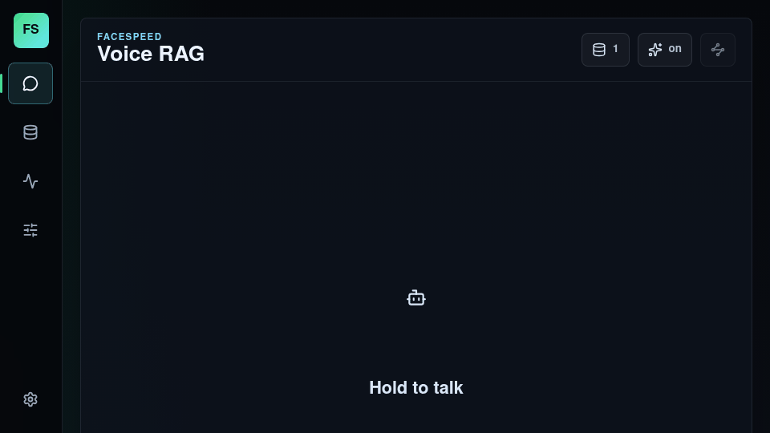
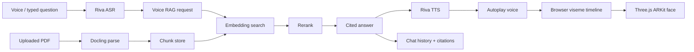

<div align="center">



# FaceSpeed Studio

Local Voice RAG over PDFs with NVIDIA Riva speech and a synchronized browser 3D speaking avatar.


[Overview](#overview) · [Quick Start](#quick-start) · [Main Path](#main-path) · [Setup](#setup) · [Evidence](#evidence) · [Docs](#docs) · [Repository Map](#repository-map)

</div>

## Overview

FaceSpeed Studio is a local product workspace for asking questions against PDF knowledge and hearing the answer through a 3D face.

The current release path is:

| Layer | Provider |
| --- | --- |
| Speech input | NVIDIA Riva ASR |
| PDF parsing | Docling provider service |
| Retrieval | Embedding API plus rerank API |
| Speech output | NVIDIA Riva TTS |
| Face output | Browser ARKit/viseme timeline on a ReadyPlayer GLB |

The product surface is intentionally small: chat history, hold-to-talk, provider status popups, avatar controls, autoplay voice, and one replay icon for the latest answer.

## Quick Start

```bash
./setup.sh
```

Open:

```text
http://127.0.0.1:6310/
```

The default root command is:

```bash
./setup.sh --setup-run
```

Fresh clones create `.env` from `.env.example` during setup, with the provider-backed main path enabled (`SERVICE_MANAGER_MODE=docker`, `PIPELINE_MODE=riva`). Processes started by setup stay detached after the command returns; stop them with `./setup.sh --stop`.

## Main Path



Provider failure is reported as an error. The main RAG path does not silently switch to keyword search or fake speech.

## Setup

| Command | Purpose |
| --- | --- |
| `./setup.sh --check` | Check OS, Python, Node, npm, Docker, GPU, ports, memory, disk, Riva, and Audio2Face. |
| `./setup.sh --setup` | Install project-local backend/frontend dependencies. |
| `./setup.sh --run` | Start backend and frontend on localhost. |
| `./setup.sh --setup-run` | Check, install, and run the local app. |
| `./setup.sh --verify` | Run setup checks, frontend tests/build, and backend tests. |
| `./setup.sh --capture-demo` | Capture the README GIF from the real browser app. |
| `./setup.sh --logs-clean` | Remove disposable runtime logs. |

Machine support:

| Machine | Status |
| --- | --- |
| Linux workstation with NVIDIA RTX GPU, Docker GPU access, Python 3.10+, Node 20+ | Supported target |
| WSL2 with NVIDIA GPU passthrough and Docker Desktop | Best effort |
| CPU-only Linux/macOS/Windows | Development only; full provider runtime incomplete |
| No terminal/network | Unsupported |

Full provider runtime expects:

| Provider | Default |
| --- | --- |
| Frontend | `http://127.0.0.1:6310` |
| Backend | `http://127.0.0.1:8020` |
| Riva TTS | `127.0.0.1:50051` |
| Riva ASR | `127.0.0.1:50151` |
| Docling | `http://127.0.0.1:8005` |
| Embedding/rerank | `http://127.0.0.1:8006` |

NVIDIA model assets and NGC credentials are not bundled. Keep `NGC_API_KEY` local and out of logs/docs/screenshots.

## Evidence

Current release evidence:

```text
test/release-readiness-2026-05-23/
```

Highlights:

| Check | Result |
| --- | --- |
| GIF banner | `demo/facespeed-release-demo.gif`, 960x540, 2.1 MB |
| Browser errors | 0 console errors, 0 page errors, 0 failed responses |
| Audio UI | 1 hidden audio element, 0 visible audio controls, 1 replay button |
| Avatar | ReadyPlayer ARKit GLB, 208 morph targets, `mouthRig=model-morphs` |
| RAG answer | Cited `docling-rag-evidence.pdf p.1` |
| Mobile | No horizontal overflow |

Key artifacts:

| File | Purpose |
| --- | --- |
| `test/release-readiness-2026-05-23/app/02-chat-answer-avatar.png` | RAG answer, citation, replay icon, no audio bar. |
| `test/release-readiness-2026-05-23/pipeline/input-question.wav` | Test voice input. |
| `test/release-readiness-2026-05-23/pipeline/docling-output-answer.wav` | Riva voice answer. |
| `test/release-readiness-2026-05-23/pipeline/docling-avatar-3d-moving.webm` | Avatar video output. |
| `test/release-readiness-2026-05-23/browser-report.json` | Browser metrics. |

## Tests

```bash
bash setup.sh --check
npm --prefix frontend test -- --run
npm --prefix frontend run build
PYTHONPATH=backend backend/.venv-linux/bin/python -m pytest backend/tests tests
node scripts/capture-release-demo.mjs
```

Current release notes are in [`RELEASE.md`](RELEASE.md), and changes are tracked in [`CHANGELOG.md`](CHANGELOG.md).

## Docs

| Document | Purpose |
| --- | --- |
| [`docs/installation.md`](docs/installation.md) | Machine support and setup modes. |
| [`docs/operations.md`](docs/operations.md) | Ports, logs, evidence, verification, cleanup. |
| [`docs/voice-rag-chatbot-handoff.md`](docs/voice-rag-chatbot-handoff.md) | Provider-backed Voice RAG handoff. |
| [`docs/nvidia-host-setup.md`](docs/nvidia-host-setup.md) | NVIDIA host notes. |
| [`CONTRIBUTING.md`](CONTRIBUTING.md) | Contribution and QA rules. |
| [`LICENSE`](LICENSE) | MIT license. |

## Repository Map

| Path | Purpose |
| --- | --- |
| `backend/` | FastAPI backend, provider clients, RAG orchestration, API tests. |
| `frontend/` | React/Vite product UI and Three.js avatar renderer. |
| `scripts/` | Setup, log cleanup, demo capture, NVIDIA helpers. |
| `docs/` | Installation, operations, troubleshooting, phase reports. |
| `logs/plans/` | Curated implementation logs. Runtime logs are disposable. |
| `test/release-readiness-2026-05-23/` | Current release evidence. |
| `tests/` | Automated pytest source tests. |

## Notes On Accuracy

- This release is verified on the local Linux workstation used for the evidence package.
- CPU-only machines can build and inspect the UI, but cannot complete the provider-backed Riva/Docling/embedding runtime alone.
- Audio2Face-3D NIM is optional; the current product path uses Riva voice plus browser ARKit morph animation.
- `frontend/public/models/readyplayer-talk-arkit.glb` is the only production browser avatar asset kept in the repo.
