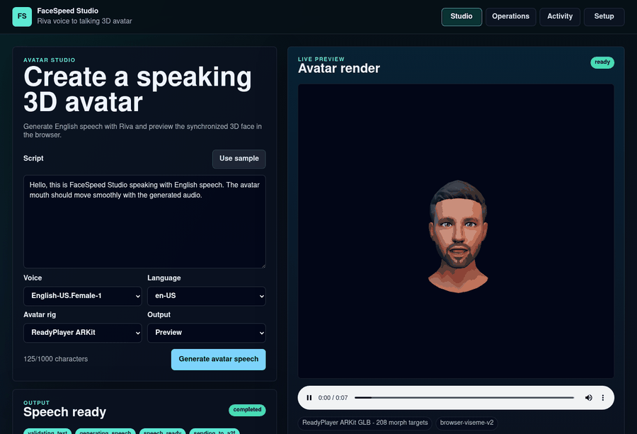
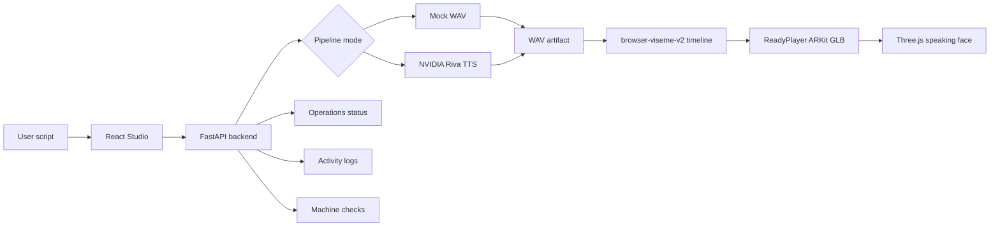

<div align="center">



# FaceSpeed Studio

English text to NVIDIA Riva speech with a synchronized browser 3D speaking avatar.


[Overview](#overview) · [Quick Start](#quick-start) · [What Works](#what-works) · [System Flow](#system-flow) · [Setup Script](#setup-script) · [NVIDIA Notes](#nvidia-notes) · [Evidence](#evidence) · [Repository Map](#repository-map)

</div>

## Overview

FaceSpeed Studio is a local product shell for creating an English speaking 3D avatar quickly:

- Type an English script.
- Generate speech through NVIDIA Riva when `PIPELINE_MODE=riva`.
- Drive a rigged ReadyPlayer ARKit GLB avatar in the browser with a generated viseme/blendshape timeline.
- Inspect runtime state, service logs, and machine readiness from secondary support tabs.

The goal is practical product output, not building a face rig from scratch. The default browser avatar is `frontend/public/models/readyplayer-talk-arkit.glb`; swap it with `VITE_FACE_MODEL_URL` if you have a better licensed GLB with ARKit-style morph targets.

## Quick Start

Run everything from the repository root:

```bash
./setup.sh
```

Then open:

```text
http://127.0.0.1:6310/
```

The default root command is the same as:

```bash
./setup.sh --setup-run
```

It checks the machine, installs local Python/Node dependencies where possible, starts the FastAPI backend, starts the Vite frontend, and keeps warnings non-blocking for local app startup.

## What Works

| Capability | Current status |
| --- | --- |
| End-user Studio UI | Working: script, voice, language, avatar rig, output mode, generation, playback, 3D preview. |
| English TTS with Riva | Working on the current host with `PIPELINE_MODE=riva` and Riva reachable at `127.0.0.1:50051`. |
| Browser 3D avatar | Working: ReadyPlayer ARKit GLB with 208 morph targets. |
| Mouth animation | Working browser timeline: `browser-viseme-v2`, interpolated and smoothed in Three.js. |
| Audio2Face-3D NIM | Optional target path. Not required for the current product demo; still needs licensed NGC access and a running NIM service. |
| Operations tab | Working status view for project service/container state. |
| Activity tab | Working service log load/filter. |
| Setup tab | Working local readiness checks. |
| One-command setup/run | Working through root `setup.sh`. |

## System Flow



## Local Ports

| Service | Address |
| --- | --- |
| Frontend | `127.0.0.1:6310` |
| Backend API | `127.0.0.1:8020` |
| Riva gRPC | `127.0.0.1:50051` |
| Audio2Face-3D gRPC | `127.0.0.1:8040` |
| Audio2Face-3D HTTP health | `127.0.0.1:8041` |

All default app ports bind to localhost.

## Setup Script

Common commands:

```bash
./setup.sh --check
./setup.sh --setup
./setup.sh --run
./setup.sh --setup-run
./setup.sh --status
./setup.sh --stop
```

NVIDIA/container helper commands:

```bash
./setup.sh --dry-run-containers
./setup.sh --list-containers
./setup.sh --stop-containers
./setup.sh --check-riva
./setup.sh --check-a2f
./setup.sh --a2f-profiles
./setup.sh --start-a2f-nim
```

Behavior:

- Missing Python/Node/npm/Docker/NGC/GPU pieces are reported as warnings when possible.
- RAM/VRAM/disk reserve checks warn by default for local app startup.
- Heavy NVIDIA pulls and NIM startup still require accepted NGC license/EULA and local `NGC_API_KEY`.
- `--stop` only stops project-owned PID-file processes and project-labeled containers.

Project container policy:

| Field | Value |
| --- | --- |
| Name prefix | `facespeed-` |
| Project label | `com.facespeed.project=NVIDIARiva-Audio2Face-facespeed` |
| Bind policy | `127.0.0.1` |
| Restart policy | `no` |

## Manual Run

Backend:

```bash
python3 -m venv backend/.venv-linux
backend/.venv-linux/bin/python -m pip install -r backend/requirements.txt
PIPELINE_MODE=riva \
RIVA_HOST=127.0.0.1 \
RIVA_PORT=50051 \
RIVA_DEFAULT_VOICE=English-US.Female-1 \
ALLOWED_ORIGINS=http://127.0.0.1:6310,http://localhost:6310 \
backend/.venv-linux/bin/python -m uvicorn src.main:app --host 127.0.0.1 --port 8020 --app-dir backend
```

Frontend:

```bash
npm --prefix frontend install
VITE_API_BASE_URL=http://127.0.0.1:8020 \
npm --prefix frontend run dev -- --host 127.0.0.1 --port 6310 --strictPort
```

## NVIDIA Notes

Riva is the production TTS path for this repo right now. Audio2Face-3D NIM remains an optional upgrade path for higher-quality facial animation data:

```bash
export NGC_API_KEY=<your-local-ngc-key>
./setup.sh --a2f-profiles
./setup.sh --start-a2f-nim
```

Use `PIPELINE_MODE=nvidia` only when both Riva and Audio2Face-3D are actually reachable. Use `PIPELINE_MODE=riva` for the current working product path: real Riva speech plus browser-side avatar animation.

Official references:

- NVIDIA Riva documentation: https://docs.nvidia.com/deeplearning/riva/user-guide/docs/
- NVIDIA Audio2Face-3D microservice documentation: https://docs.nvidia.com/ace/audio2face-3d-microservice/
- NVIDIA NGC: https://catalog.ngc.nvidia.com/

Keep NGC keys out of logs, docs, shell history snippets, screenshots, and commits.

## Evidence

Latest QA evidence:

```text
test/production-enduser-evidence-2026-05-22/
```

Highlights from that run:

| Check | Result |
| --- | --- |
| Browser console errors | `0` |
| Page errors | `0` |
| HTTP 4xx/5xx responses | `0` |
| Generated job | `17309abe-6bd3-4d77-b91d-a6d21a46ca12` |
| Animation engine | `browser-viseme-v2` |
| Animation frames | `451` |
| 3D model | ReadyPlayer ARKit GLB, `208` morph targets |
| Audio file | PCM WAV, mono, `22050 Hz`, `7.512 s`, RMS `1949.23`, peak `17342` |

Evidence screenshots:

| File | What it proves |
| --- | --- |
| `screenshots/01-studio-ready.png` | Studio loads with real 3D avatar and input controls. |
| `screenshots/02-avatar-speaking-output.png` | Generated audio, animation artifact, completed job, and speaking mouth pose. |
| `screenshots/03-operations-status.png` | Operations status view works. |
| `screenshots/04-activity-logs-filtered.png` | Activity log load/filter works. |
| `screenshots/05-setup-readiness.png` | Machine readiness checks load. |
| `screenshots/06-mobile-studio.png` | Mobile layout remains usable. |

## Tests

Current verification commands:

```bash
bash -n setup.sh && bash -n scripts/setup.sh
npm --prefix frontend test -- --run
npm --prefix frontend run build
PYTHONPATH=backend backend/.venv-linux/bin/python -m pytest backend/tests tests
```

Current result:

| Command | Result |
| --- | --- |
| Shell syntax | Passed |
| Frontend tests | Passed, 3 tests |
| Frontend build | Passed; Vite warns that the Three.js bundle is over 500 kB |
| Backend tests | Passed, 33 tests |
| Playwright evidence | Passed with 6 reviewed screenshots and GIF banner |

## Repository Map

```text
backend/                 FastAPI API, job pipeline, Riva/A2F clients, service/system routes
configs/                 Service allowlist/config
docs/                    Assets, setup notes, troubleshooting, phase reports
frontend/                React/Vite Studio UI and Three.js avatar renderer
plans/                   Implementation plans and trackers
scripts/                 Setup, NVIDIA helpers, A2F utility scripts
skills/                  Local skill instructions kept for this project
.codex/skills/           Codex skill copies kept as requested
test/                    Browser evidence and QA artifacts
setup.sh                 Root one-command setup/run/status/stop entrypoint
```

Generated runtime folders are ignored by git: `logs/`, `outputs/`, `.cache/`, `frontend/dist/`, `frontend/node_modules/`, Python caches, and local virtualenvs.

## Accuracy Notes

- The current polished path is English Riva TTS plus browser-side `browser-viseme-v2` avatar animation.
- The browser avatar is a real rigged GLB with morph targets, but it is not NVIDIA Audio2Face-3D output unless `PIPELINE_MODE=nvidia` and a reachable A2F-3D service are configured.
- Audio2Face-3D outputs animation data, not a finished character. You still need a licensed rigged avatar or a runtime such as a compatible GLB/Unreal asset.
- The included ReadyPlayer model is a practical development asset. Confirm licensing before commercial redistribution.
- The app is local-first. It does not include auth, billing, cloud deployment, multi-user storage, or public hosting.
