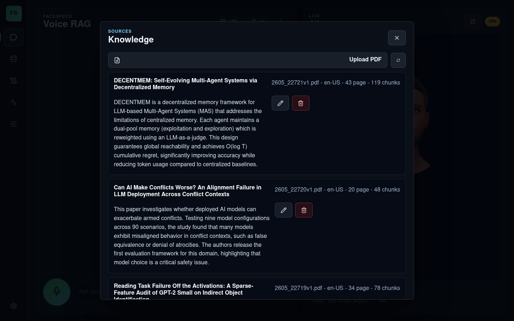
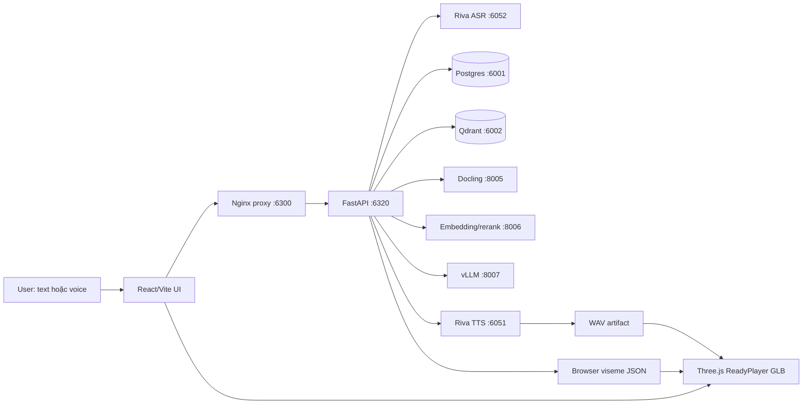

<div align="center">



# FaceSpeed Studio

Voice RAG cục bộ trên PDF, dùng NVIDIA Riva cho ASR/TTS và avatar 3D chạy trong trình duyệt.

Updated: 2026-05-26


[Chạy Nhanh](#chay-nhanh) · [Runtime](#runtime) · [API Ngoài](#api-ngoai) · [Kiến Trúc](#kien-truc) · [Dữ Liệu Và Test](#du-lieu-va-test) · [Docs](#docs) · [Repo Map](#repo-map)

</div>

## Tổng Quan

FaceSpeed Studio là workspace local để hỏi đáp trên kho PDF bằng text hoặc giọng nói. Luồng chính hiện tại:

| Bước | Service thật đang dùng |
| --- | --- |
| Nhận câu hỏi | Text input hoặc NVIDIA Riva ASR |
| Parse PDF | API ngoài repo: Docling provider `http://127.0.0.1:8005` |
| Lưu metadata/chunk | Postgres `127.0.0.1:6001` |
| Vector search | Qdrant `127.0.0.1:6002/6003` |
| Embedding/rerank | API ngoài repo: provider `http://127.0.0.1:8006` |
| Teacher/review LLM | API ngoài repo: vLLM OpenAI-compatible `http://127.0.0.1:8007/v1` |
| Đọc câu trả lời | NVIDIA Riva TTS `127.0.0.1:6051` |
| Avatar nói | Browser ARKit/viseme timeline trên ReadyPlayer GLB |

App chạy sau nginx proxy để browser chỉ cần một URL: `http://127.0.0.1:6300/`. Backend và provider failure được báo lỗi thật; project không giả lập câu trả lời, không tự fallback sang mock khi main path fail.

<a id="chay-nhanh"></a>

## Chạy Nhanh

```bash
./setup.sh
```

Mở app:

```text
http://127.0.0.1:6300/
```

Dừng toàn bộ phần project sở hữu:

```bash
./setup.sh --stop
```

`./setup.sh`, `./setup.sh --run`, và `./setup.sh --setup-run` đều stop runtime cũ trước, sau đó start lại bằng tmux. Không dùng `start.sh` riêng.

<a id="runtime"></a>

## Runtime

### Tmux

| Session | Chức năng | Xem log |
| --- | --- | --- |
| `facespeed-riva-docker` | Docker Compose: nginx, Postgres, Qdrant | `tmux attach -t facespeed-riva-docker` |
| `facespeed-riva-tts` | Riva TTS trên `127.0.0.1:6051` | `tmux attach -t facespeed-riva-tts` |
| `facespeed-riva-asr` | Riva ASR trên `127.0.0.1:6052` | `tmux attach -t facespeed-riva-asr` |
| `facespeed-riva-backend` | FastAPI backend trên `127.0.0.1:6320` | `tmux attach -t facespeed-riva-backend` |
| `facespeed-riva-frontend` | Vite frontend trên `127.0.0.1:6310` | `tmux attach -t facespeed-riva-frontend` |

Thoát tmux mà không tắt process: `Ctrl+B`, rồi `D`.

### Port

| Service | Default | Ghi chú |
| --- | --- | --- |
| App proxy | `http://127.0.0.1:6300` | URL chính để mở browser/IDE port forwarding |
| Frontend | `http://127.0.0.1:6310` | Vite dev server, nginx proxy tới đây |
| Backend | `http://127.0.0.1:6320` | FastAPI, nginx proxy `/api/*` tới đây |
| Postgres | `127.0.0.1:6001` | Metadata PDF, prompt, session, agent events |
| Qdrant HTTP/gRPC | `127.0.0.1:6002/6003` | Vector store |
| Riva TTS | `127.0.0.1:6051` | Voice output |
| Riva ASR | `127.0.0.1:6052` | Voice input |
| Audio2Face optional | `127.0.0.1:6040/6041` | Không bắt buộc cho path hiện tại |
| Docling | `http://127.0.0.1:8005` | Provider sẵn trên máy |
| Embedding/rerank | `http://127.0.0.1:8006` | Provider sẵn trên máy |
| vLLM | `http://127.0.0.1:8007/v1` | Provider sẵn trên máy |

Các port project sở hữu nằm trong `6000-6500` và tránh `6000`. Service do `docker-compose.yml`, `scripts/setup.sh`, hoặc tmux của repo start thì tính là runtime của project. Provider `8005/8006/8007` là service ngoài project trên workstation này, không phải bridge benchmark `6105/6106/6107`.

<a id="api-ngoai"></a>

### API Ngoài Repo Cần Có Sẵn

Các service dưới đây không được source này tự dựng bằng `./setup.sh` hoặc `docker-compose.yml`. Backend chỉ gọi API tới chúng, nên nếu chúng tắt hoặc đổi port thì RAG/voice chat sẽ báo lỗi thật.

| API ngoài repo | Port mặc định | Biến cấu hình | Backend dùng để làm gì | Check nhanh |
| --- | --- | --- | --- | --- |
| Docling server | `http://127.0.0.1:8005` | `DOCLING_API_BASE_URL` | Parse PDF thành markdown/chunk đầu vào | `curl http://127.0.0.1:8005/health` |
| Embedding/rerank server | `http://127.0.0.1:8006` | `EMBEDDING_API_BASE_URL` | Tạo embedding query/chunk và rerank kết quả search | `curl http://127.0.0.1:8006/health` |
| vLLM OpenAI-compatible server | `http://127.0.0.1:8007/v1` | `LLM_API_BASE_URL` | Teacher/review answer, metadata cleanup nếu bật LLM | `curl http://127.0.0.1:8007/v1/models` |

Các service không nằm trong bảng này là do repo quản lý hoặc optional theo path hiện tại:

| Runtime thuộc repo | Vì sao không tính là API ngoài |
| --- | --- |
| Nginx `6300`, Postgres `6001`, Qdrant `6002/6003` | Chạy từ `docker-compose.yml` trong session `facespeed-riva-docker` |
| Backend `6320`, frontend `6310` | Chạy từ `scripts/setup.sh` trong tmux project |
| Riva TTS `6051`, Riva ASR `6052` | `scripts/setup.sh` start bằng tmux `facespeed-riva-tts` và `facespeed-riva-asr` nếu Riva quickstart/model đã được provision |
| Audio2Face `6040/6041` | Optional, không bắt buộc cho path browser ARKit hiện tại |

Contract backend đang gọi:

| API | Method/path | Request format | Response format backend cần |
| --- | --- | --- | --- |
| Docling parse | `POST /api/v1/parse` | `multipart/form-data`, field `files`, file PDF, content type `application/pdf` | JSON có `status: 200`, `result` là array; item đầu có `content` markdown không rỗng, `file_name` optional, `error` rỗng |
| Embedding | `POST /api/v1/embed` | JSON `{"texts": ["..."]}`; text đã trim/normalize whitespace, không được rỗng | JSON có `status: 200`, `result` là array vector, số vector bằng số text; mỗi vector là array số float không rỗng |
| Rerank | `POST /api/v1/rerank` | JSON `{"query": "...", "documents": ["..."]}`; query/document không được rỗng | JSON có `status: 200`, `result` là array object `{"index": number, "score": number}` |
| vLLM health/model | `GET /v1/models` nếu `LLM_API_BASE_URL=http://127.0.0.1:8007/v1` | Không có body | HTTP `200` nghĩa là LLM available |
| vLLM chat | `POST /v1/chat/completions` nếu `LLM_API_BASE_URL=http://127.0.0.1:8007/v1` | OpenAI-compatible chat completion | JSON có `choices[0].message.content` |

Ví dụ Docling:

```bash
curl -F "files=@paper.pdf;type=application/pdf" \
  http://127.0.0.1:8005/api/v1/parse
```

```json
{
  "status": 200,
  "description": "ok",
  "result": [
    {
      "file_name": "paper.pdf",
      "content": "# Title\n\nParsed markdown...",
      "error": ""
    }
  ]
}
```

Ví dụ embedding:

```json
{
  "texts": ["question or chunk text"]
}
```

```json
{
  "status": 200,
  "result": [[0.0123, -0.0456, 0.0789]]
}
```

Benchmark hiện tại ghi nhận embedding provider trả vector 2048 chiều. Backend không hard-code số chiều, nhưng Qdrant collection sẽ được tạo theo chiều vector đầu tiên; nếu đổi embedding model làm đổi dimension thì cần reindex hoặc xóa collection `QDRANT_COLLECTION`.

Ví dụ rerank:

```json
{
  "query": "What does the paper propose?",
  "documents": ["candidate chunk 1", "candidate chunk 2"]
}
```

```json
{
  "status": 200,
  "result": [
    {"index": 0, "score": 0.91},
    {"index": 1, "score": 0.42}
  ]
}
```

Ví dụ vLLM:

```json
{
  "model": "google/gemma-4-E4B-it",
  "messages": [
    {"role": "system", "content": "system prompt"},
    {"role": "user", "content": "user prompt"}
  ],
  "temperature": 0.2,
  "max_tokens": 700
}
```

```json
{
  "choices": [
    {"message": {"content": "answer text"}}
  ]
}
```

Model vLLM mặc định là `google/gemma-4-E4B-it`. Nếu đổi model hoặc đổi server vLLM, sửa trong `.env`:

```dotenv
LLM_API_BASE_URL=http://127.0.0.1:8007/v1
LLM_MODEL=google/gemma-4-E4B-it
LLM_TEMPERATURE=0.2
LLM_TIMEOUT_SECONDS=60
```

### Env Quan Trọng

| Biến | Giá trị mặc định | Ý nghĩa |
| --- | --- | --- |
| `FACESPEED_PROXY_PORT` | `6300` | Port browser chính |
| `TMUX_PREFIX` | `facespeed-riva` | Prefix tránh trùng tmux project khác |
| `DOCLING_API_BASE_URL` | `http://127.0.0.1:8005` | PDF parser |
| `EMBEDDING_API_BASE_URL` | `http://127.0.0.1:8006` | Embedding/rerank |
| `LLM_API_BASE_URL` | `http://127.0.0.1:8007/v1` | vLLM judge/teacher |
| `RIVA_TTS_MAX_CONCURRENCY` | `1` | Tránh Riva TTS timeout/crash khi nhiều request |
| `VOICE_CHAT_TTS_MAX_CHARS` | `150` | Audio preview ngắn; câu trả lời text vẫn đầy đủ |

`.env` thật được ignore. Cập nhật default public ở `.env.example`.

<a id="kien-truc"></a>

## Kiến Trúc



Luồng nghiệp vụ:

1. Upload PDF qua Sources popup.
2. Backend gửi PDF sang Docling, normalize markdown, chia section/chunk.
3. Embedding provider tạo vector; metadata/chunk ghi vào Postgres, vector ghi vào Qdrant.
4. Khi hỏi, backend search Qdrant, mở rộng graph chunk, rerank bằng provider `8006`.
5. Teacher/review tạo câu trả lời có citation; agent trace ghi lại các bước lead/search/review/teacher.
6. Riva TTS tạo audio WAV; backend tạo viseme timeline; frontend phát audio và sync avatar.

Module chính:

| Path | Vai trò |
| --- | --- |
| `backend/src/routes/` | FastAPI route cho jobs, artifacts, system, services, Voice RAG |
| `backend/src/services/rag_service.py` | Orchestrator RAG: ingest, search, answer, trace, voice turn |
| `backend/src/services/rag_store.py` | Postgres/Qdrant persistence |
| `backend/src/services/*_client.py` | Client Docling, embedding/rerank, LLM, Riva, Audio2Face |
| `frontend/src/pages/PipelinePage.tsx` | UI chat/voice/Sources/avatar runtime chính |
| `frontend/src/components/AgentTraceCanvas.tsx` | Canvas trace cho agent/provider/database |
| `docker-compose.yml` | Nginx, Postgres, Qdrant |
| `docker/nginx/` | Template nginx proxy một port |
| `scripts/setup.sh` | Entrypoint check/setup/run/stop/verify |

<a id="du-lieu-va-test"></a>

## Dữ Liệu Và Test

Runtime hiện tại đã index:

| Metric | Value |
| --- | ---: |
| PDF | 100 |
| Chunk | 11,022 |
| Ngôn ngữ | `en-US`, `vi-VN` |
| Postgres | available |
| Qdrant | available |
| vLLM | available |

Benchmark RAG Voice ngày 2026-05-25:

| Metric | Value |
| --- | ---: |
| Test case | 80 |
| Pass | 80/80 |
| Đúng file/page/chunk | 100% |
| Single-user p50 | khoảng 6.3s |
| 10-user p95 | khoảng 57-58s |

Đọc nhanh:

- Benchmark summary: [`tests/benchmarks/README.md`](tests/benchmarks/README.md)
- Benchmark report đầy đủ: [`tests/benchmarks/REPORT-2026-05-25-rag-voice.md`](tests/benchmarks/REPORT-2026-05-25-rag-voice.md)
- Nginx/voice smoke: [`tests/nginx-proxy/test-nginx-proxy-20260526-v1.md`](tests/nginx-proxy/test-nginx-proxy-20260526-v1.md)
- Screenshot Sources 100 PDF: [`tests/nginx-proxy/evidence-2026-05-26/sources-popup-100-docs.png`](tests/nginx-proxy/evidence-2026-05-26/sources-popup-100-docs.png)

Validation thường dùng:

```bash
bash -n scripts/setup.sh
docker compose config --quiet
curl -fsS http://127.0.0.1:6300/api/rag/status
npm --prefix frontend test -- --run
npm --prefix frontend run build
backend/.venv-linux/bin/python -m pytest tests
```

## Vận Hành Nhanh

| Tình huống | Cách kiểm tra |
| --- | --- |
| Không thấy file PDF trong UI | Mở Sources popup, nút database ở header; backend check `curl http://127.0.0.1:6300/api/documents` |
| Browser báo backend connection refused | Mở `6300`, không mở trực tiếp frontend `6310` nếu IDE không forward backend |
| `/api/voice/chat` trả 503 embedding | Kiểm tra provider thật `curl http://127.0.0.1:8006/health` |
| Riva TTS timeout | Giữ `RIVA_TTS_MAX_CONCURRENCY=1`, `VOICE_CHAT_TTS_MAX_CHARS=150` |
| Cần xem log | Attach tmux session tương ứng, không tìm log rời rạc trước |
| Dừng sạch | `./setup.sh --stop` |

## VRAM Và Tài Nguyên

Ước tính từ benchmark 2026-05-25 trên NVIDIA RTX PRO 5000 Blackwell:

| Item | Value |
| --- | ---: |
| GPU total | 48,935 MiB |
| Max observed used | 39,833 MiB |
| Min observed free | 8,574 MiB |
| Estimated FaceSpeed incremental VRAM | khoảng 4,006 MiB |
| Recommended free before start | khoảng 9,000 MiB |

Các ngưỡng này là operational guardrail từ máy benchmark, không phải cam kết vendor.

<a id="docs"></a>

## Docs

| File | Nội dung |
| --- | --- |
| [`docs/README.md`](docs/README.md) | Index tài liệu |
| [`docs/installation.md`](docs/installation.md) | Cài đặt, machine support, setup mode |
| [`docs/operations.md`](docs/operations.md) | Port, tmux, cleanup, verification |
| [`docs/troubleshooting/resource-and-ports.md`](docs/troubleshooting/resource-and-ports.md) | Debug port/tài nguyên |
| [`docs/voice-rag-chatbot-handoff.md`](docs/voice-rag-chatbot-handoff.md) | Handoff Voice RAG provider-backed |
| [`docs/task/task-nginx-proxy-docs-20260526-v1.md`](docs/task/task-nginx-proxy-docs-20260526-v1.md) | Ghi nhận nginx/proxy/provider update |
| [`CHANGELOG.md`](CHANGELOG.md) | Thay đổi theo version |
| [`RELEASE.md`](RELEASE.md) | Release metadata hiện tại |

<a id="repo-map"></a>

## Repo Map

| Path | Nội dung |
| --- | --- |
| `backend/` | FastAPI, provider clients, RAG orchestration, persistence |
| `frontend/` | React/Vite UI, Three.js avatar, trace canvas |
| `docker/` | Nginx proxy config |
| `docs/` | Tài liệu vận hành, plan, task, troubleshooting |
| `logs/` | Curated task logs; runtime logs xem qua tmux |
| `plans/` | Plan đã đóng và plan đang chạy |
| `scripts/` | Setup, Playwright helper, Riva helper |
| `tests/` | Benchmark, smoke evidence, reports |

## Ghi Chú Chính Xác

- Project không bundle NVIDIA model asset, NGC key hoặc secret.
- Audio2Face-3D NIM vẫn là optional; path chính hiện tại dùng Riva voice + browser ARKit morph animation.
- `frontend/public/models/readyplayer-talk-arkit.glb` là avatar browser asset chính.
- README này mô tả trạng thái repo và runtime đã verify trên workstation local ngày 2026-05-26.

dev by ambrouse
